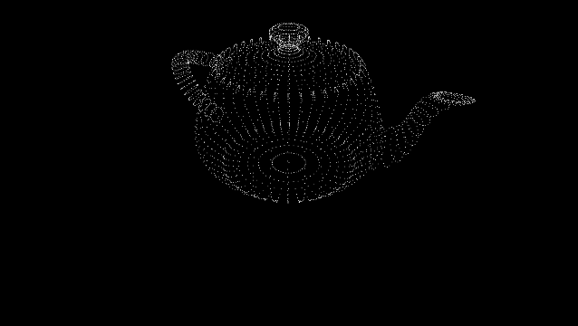
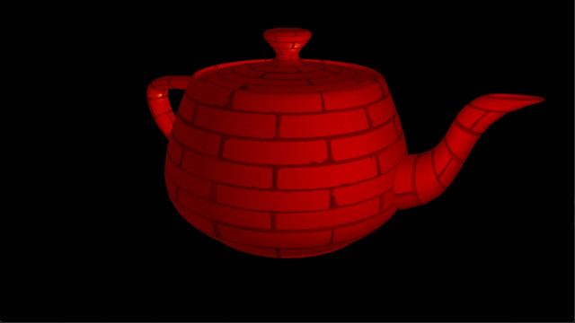

# Interactive Graphics

Projects for CS6610 Interactive Graphics at University of Utah (Spring 2022) 
made in _moderngl_ with Python

- Videos for the class on YouTube [link](https://www.youtube.com/playlist?list=PLplnkTzzqsZS3R5DjmCQsqupu43oS9CFN)
- Class website [link](https://graphics.cs.utah.edu/courses/cs6610/spring2022/)

## Showcase

### Project 1 - Hello World

A window with background color changing in time

### Project 2 - Transformations

An orbit view window displaying the vertices of a 3D object as points

### Project 3 - Shading

Press numbers 1 to 5 to change shading from: flat, normals, lambert, specular
or Blinn-Phong

### Project 4 - Textures

Using images for a diffuse texture and a specular map

## Dependencies

- moderngl
- moderngl-window
